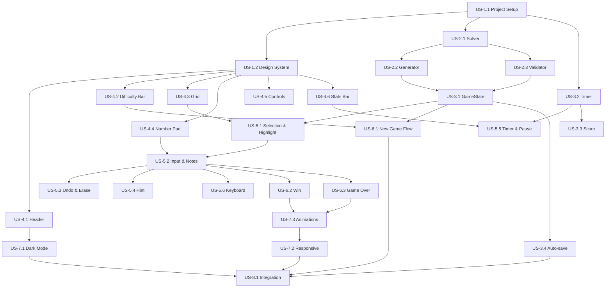

# User Stories Index

> **Quy ước**: P0 = must-have, P1 = should-have, P2 = nice-to-have
> Implement theo thứ tự dependency graph bên dưới.

## Tổng kết

| Metric | Value |
|---|---|
| **Tổng User Stories** | 20 |
| **Tổng Story Points** | 56 |
| **P0 (Must-have)** | 14 US (39 SP) |
| **P1 (Should-have)** | 5 US (14 SP) |
| **P2 (Nice-to-have)** | 1 US (3 SP) |

## Danh sách User Stories

| File | US ID | Tên | Priority | SP | Dependencies |
|---|---|---|---|---|---|
| [US-1.1](epic-1/US-1.1-project-setup.md) | US-1.1 | Khởi tạo dự án | P0 | 1 | — |
| [US-1.2](epic-1/US-1.2-design-system.md) | US-1.2 | Design System & Base Styles | P0 | 2 | US-1.1 |
| [US-2.1](epic-2/US-2.1-solver.md) | US-2.1 | Thuật toán giải Sudoku | P0 | 3 | US-1.1 |
| [US-2.2](epic-2/US-2.2-generator.md) | US-2.2 | Generator tạo puzzle | P0 | 5 | US-2.1 |
| [US-2.3](epic-2/US-2.3-validator.md) | US-2.3 | Validation nước đi | P0 | 2 | US-2.1 |
| [US-3.1](epic-3/US-3.1-game-state.md) | US-3.1 | Quản lý trạng thái game | P0 | 5 | US-2.2, US-2.3 |
| [US-3.2](epic-3/US-3.2-timer.md) | US-3.2 | Timer | P0 | 2 | US-1.1 |
| [US-3.3](epic-3/US-3.3-score.md) | US-3.3 | Tính điểm | P1 | 2 | US-3.2 |
| [US-3.4](epic-3/US-3.4-auto-save.md) | US-3.4 | Auto-save & Load | P1 | 3 | US-3.1 |
| [US-4.1](epic-4/US-4.1-header.md) | US-4.1 | Header & Navigation | P0 | 2 | US-1.2 |
| [US-4.2](epic-4/US-4.2-difficulty-bar.md) | US-4.2 | Thanh chọn độ khó | P0 | 2 | US-1.2 |
| [US-4.3](epic-4/US-4.3-grid.md) | US-4.3 | Bảng Sudoku 9×9 | P0 | 5 | US-1.2 |
| [US-4.4](epic-4/US-4.4-number-pad.md) | US-4.4 | Number Pad | P0 | 3 | US-1.2 |
| [US-4.5](epic-4/US-4.5-controls.md) | US-4.5 | Game Controls | P0 | 3 | US-1.2 |
| [US-4.6](epic-4/US-4.6-stats-bar.md) | US-4.6 | Stats Bar | P0 | 2 | US-1.2 |
| [US-5.1](epic-5/US-5.1-cell-selection.md) | US-5.1 | Cell Selection & Highlighting | P0 | 3 | US-4.3, US-3.1 |
| [US-5.2](epic-5/US-5.2-input-notes.md) | US-5.2 | Nhập số & Notes | P0 | 3 | US-5.1, US-4.4 |
| [US-5.3](epic-5/US-5.3-undo-erase.md) | US-5.3 | Undo & Erase | P0 | 2 | US-5.2 |
| [US-5.4](epic-5/US-5.4-hint.md) | US-5.4 | Hint | P1 | 2 | US-5.2 |
| [US-5.5](epic-5/US-5.5-timer-pause.md) | US-5.5 | Timer & Pause | P1 | 2 | US-3.2, US-4.6 |
| [US-5.6](epic-5/US-5.6-keyboard.md) | US-5.6 | Keyboard Input | P1 | 3 | US-5.2 |
| [US-6.1](epic-6/US-6.1-new-game.md) | US-6.1 | New Game Flow | P0 | 3 | US-3.1, US-4.2 |
| [US-6.2](epic-6/US-6.2-win.md) | US-6.2 | Win Celebration | P0 | 3 | US-5.2 |
| [US-6.3](epic-6/US-6.3-game-over.md) | US-6.3 | Game Over | P0 | 2 | US-5.2 |
| [US-7.1](epic-7/US-7.1-dark-mode.md) | US-7.1 | Dark Mode | P1 | 3 | US-4.1 |
| [US-7.2](epic-7/US-7.2-responsive.md) | US-7.2 | Responsive Design | P1 | 3 | All UI |
| [US-7.3](epic-7/US-7.3-animations.md) | US-7.3 | Micro-animations | P2 | 3 | All UI |
| [US-8.1](epic-8/US-8.1-integration.md) | US-8.1 | Kết nối toàn bộ | P0 | 5 | All |

## Dependency Graph

